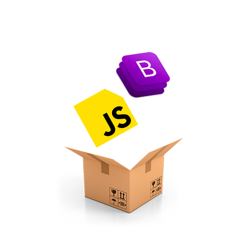

Небольшой конструктор на чистом JS. 

В данном проекте применил ООП, наименования классов для тэгов и сетка на bootstrap, а сборка на parcel. 

Сборку собрал в папку dist, но решил залить весь проект. 

Если вы хотите посмотреть проект у себя на компьютере, можно скачать проект и ввести по очереди следующие команды в терминал.

npm i 

npm run serve

